# AI Prototyping Playground

High-fidelity UI prototypes for demonstrating user experiences and interactions, built with Figma's design system.

## Getting Started

> Screenshots captured automatically on 2026-02-24

### Video walkthrough


---

### 0. Prerequisites

- **[Download Cursor](https://www.cursor.com/downloads)**
- **[Install the Claude CLI](https://docs.anthropic.com/en/docs/claude-code/overview)**: `npm install -g @anthropic-ai/claude-code`
- **Git SSH authentication**: You'll need an SSH key added to your GitHub account to clone and push. If you haven't set this up, follow the [SSH key setup guide](./docs/ssh-key-setup.md).

### 1. Clone and run setup

Open a terminal and paste this into Claude:

```bash
claude "Clone git@github.com:figma/prototype-playground.git, cd into it, and run ./setup.sh"
```

Open the cloned repo in Cursor. You should see the repository root
with `setup.sh`, `templates/`, and other top-level files.

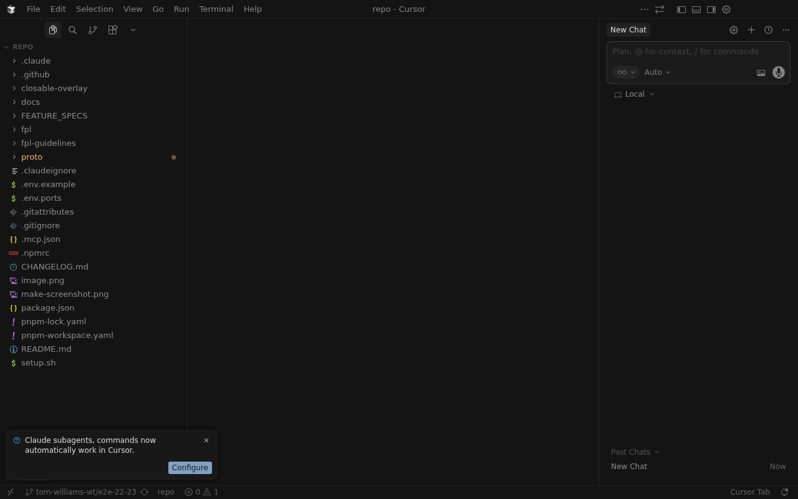

Setup installs Homebrew (if needed), Node 22, pnpm, builds all packages, installs the Cursor extension, and opens Cursor automatically when done.

### 2. Run `/setup`

Open a terminal in Cursor and run `./setup.sh`, which installs
dependencies, builds packages, and installs the Cursor extension.

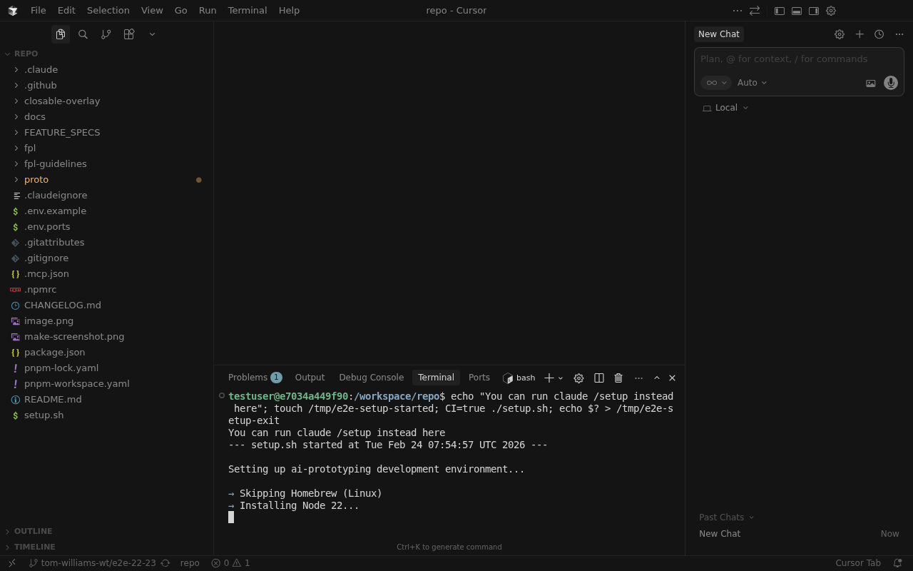

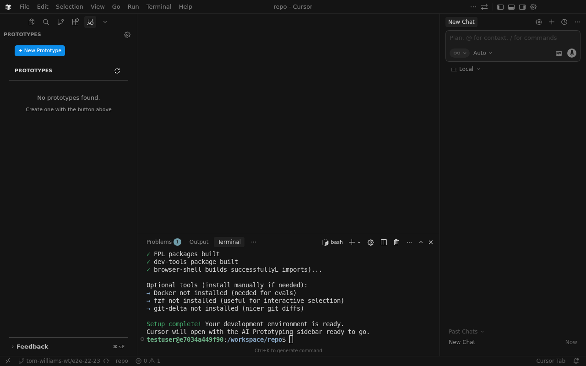

Setup takes a minute or two. When it's done you'll see
"Setup finished successfully" in the agent panel.

### 3. Open the Prototypes sidebar

Click the **Figma Prototyping** icon in the activity bar to open the
sidebar. If you don't see the icon, open the command palette
(`Cmd+Shift+P`) and search for "Figma Prototyping".

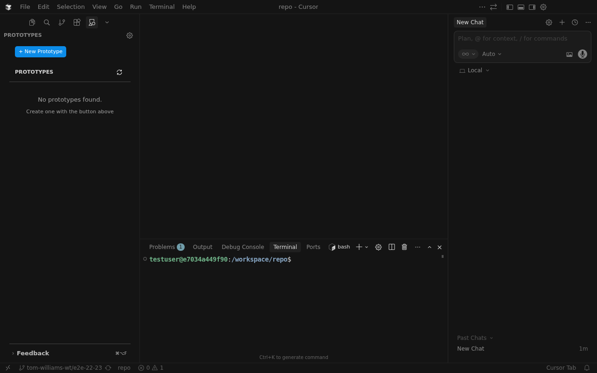

### 4. Create a new prototype

Click **+ New Prototype** in the sidebar to open the scaffold wizard.

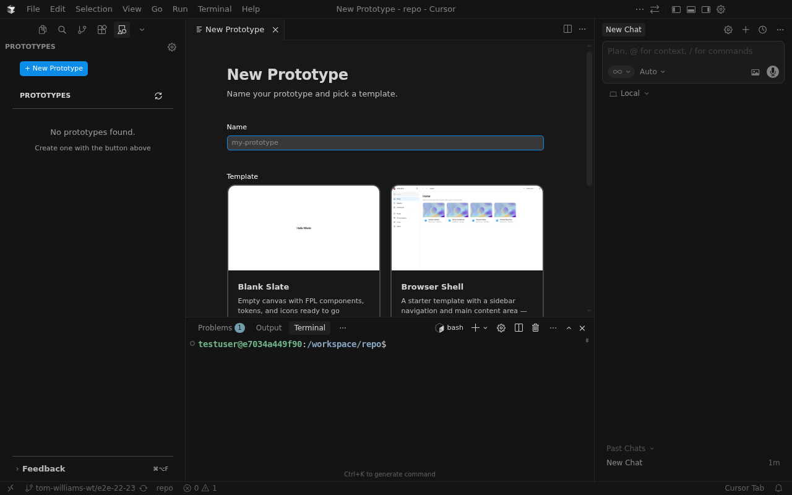

Enter a name for your prototype (must be unique, lowercase, no spaces).

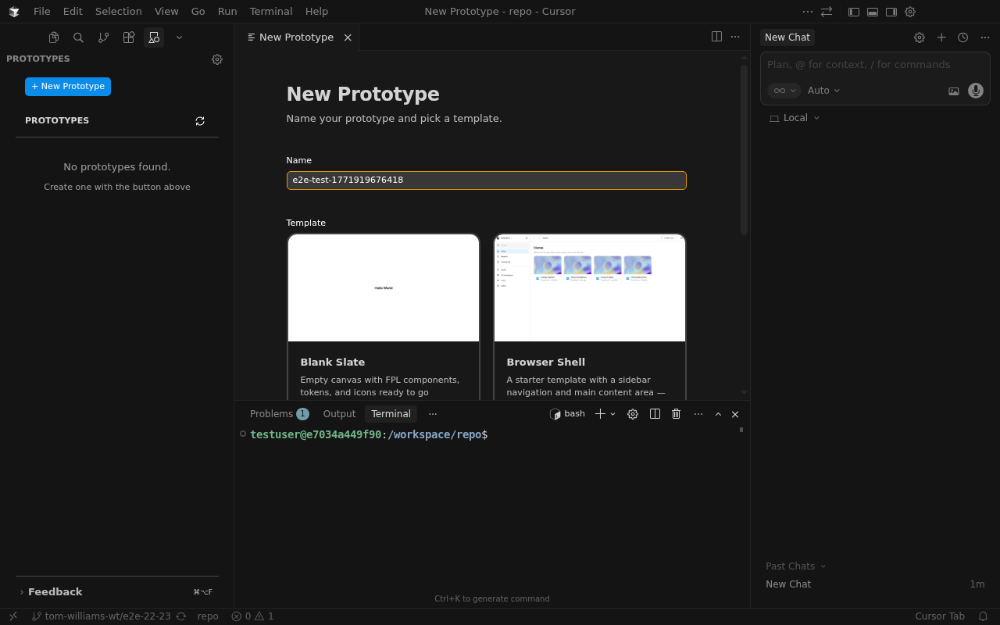

Choose a template — **Blank Slate** for a minimal starting point, or
**Browser Shell** for a sidebar-navigation layout. Then click
**Create Prototype**.

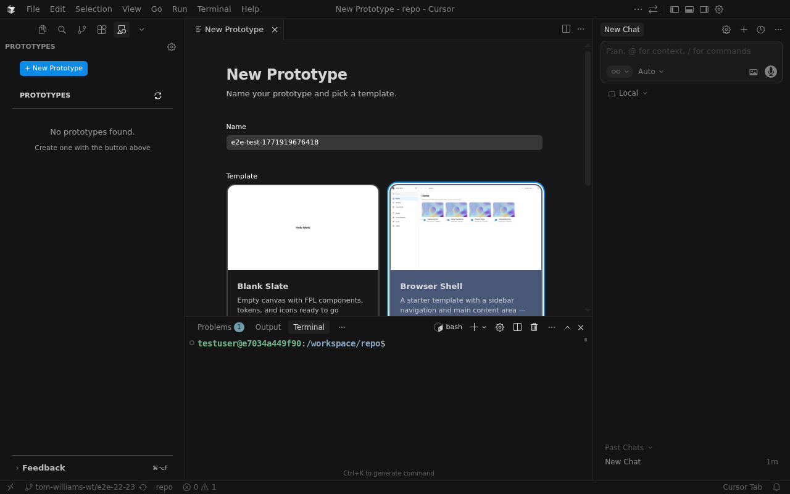

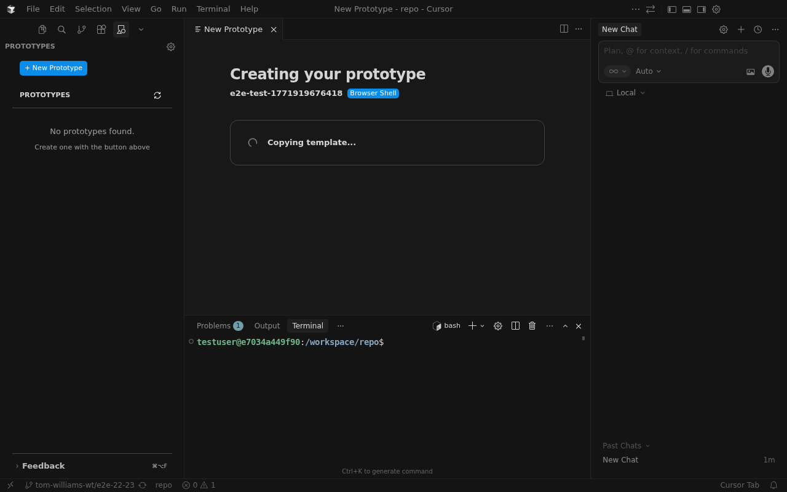

### 5. Wait for scaffolding to finish

The extension creates a git worktree, copies the template, and installs
dependencies. When it's done, you'll see **Open Here** and
**Open in New Window** buttons.

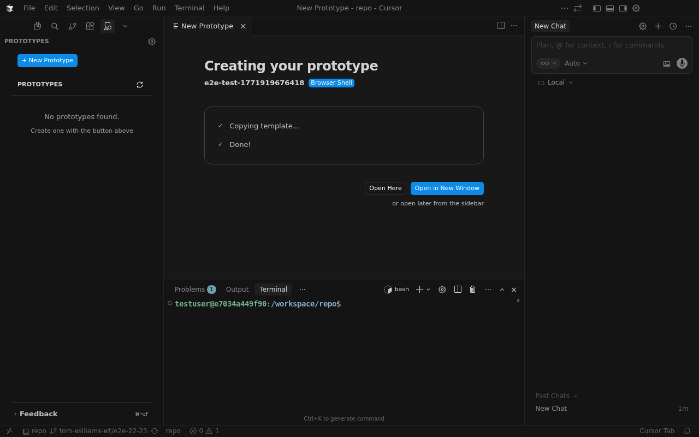

### 6. Open the prototype workspace

Click **Open Here** (or **Open in New Window**) to load the prototype
workspace. Cursor reloads with your prototype's files in the sidebar,
`App.tsx` open in the editor, and a live preview running in Simple Browser.

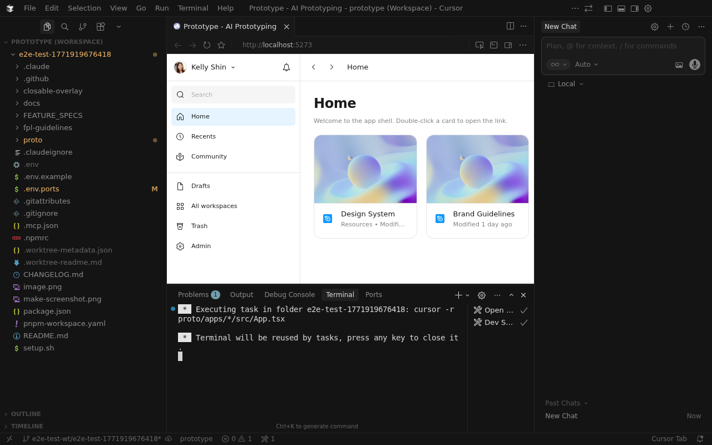

The dev server starts automatically. When Vite is ready, Simple Browser
opens with a live preview of your prototype. Any edits to source files
are reflected instantly via hot module replacement (HMR).

### 7. Start building with the agent

Open the Cursor agent panel (`Cmd+I`) and describe what you want to
build. The agent reads your project files and edits code directly.

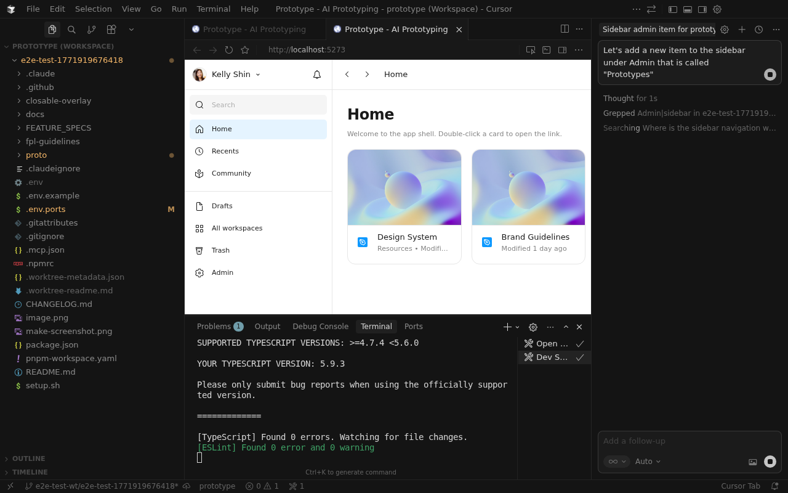

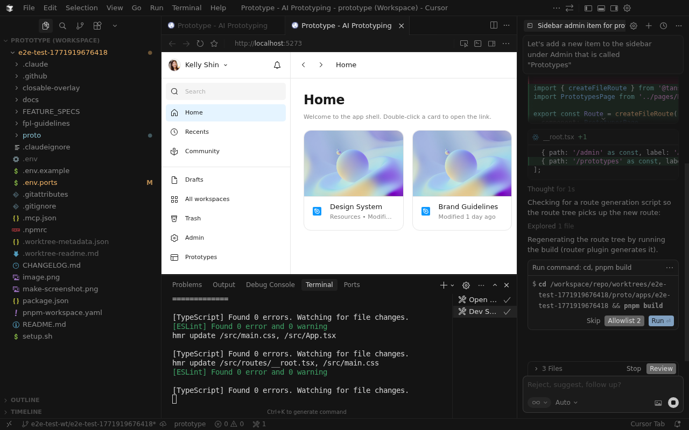

The agent modifies your source files and the changes appear in the
live preview immediately via Vite HMR. You can iterate by sending
follow-up prompts or editing the code yourself.

### 8. Share the prototype

Ask the agent to commit your changes and share the prototype.
The `/share` command pushes your branch and triggers a GitHub Actions
workflow that deploys your prototype to a shareable URL.

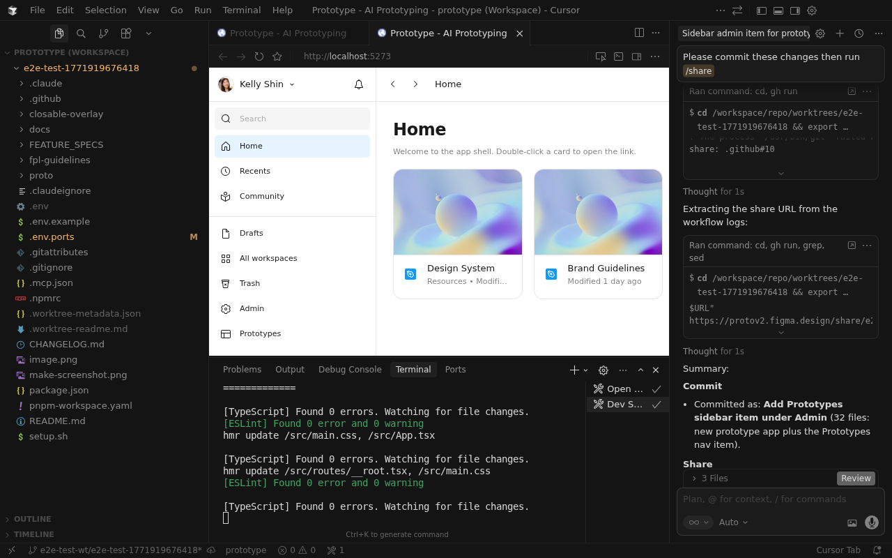

The agent commits your changes, pushes the branch, and triggers a
deployment workflow. Once complete, you'll get a shareable URL.

---

## Troubleshooting

### Setup failed

If `setup.sh` fails, check `setup.log` at the repo root for details. Post in [#feat-internal-ai-prototyping](https://figma.enterprise.slack.com/archives/C0AA95N5JTD) with the error and your OS version (`sw_vers`).

### "Cannot find module '@figma/fpl-components'" or similar

FPL packages are published to GitHub Packages. Make sure setup completed successfully and your `~/.npmrc` has a valid auth token. Run:

```bash
pnpm install
```

### Components render without Figma styling

Check that CSS imports are in correct order in `main.tsx`:

```tsx
import '@figma/fpl-tokens/index.css';   // FIRST
import '@figma/fpl-components/fpl.css'; // SECOND
```

## Project Structure

```text
/
├── templates/               # Prototype templates
│   ├── blank_slate/         # Minimal starting point
│   ├── browser-shell/       # Sidebar-navigation layout
│   ├── eval-starter/        # Evaluation starter
│   ├── figma-design/        # Figma design template
│   ├── figma-figjam/        # FigJam template
│   └── make/                # Make template
├── packages/                # Shared packages
│   └── shared/              # Shared workspace package
├── apps/                    # Prototype applications (created via worktrees)
├── .claude/                 # Claude configuration
└── .github/                 # GitHub workflows
```

## Important Notes

This repository is for **prototyping only**:

- No data persistence (everything resets on refresh)
- Features only need to demonstrate UX, not full functionality
- Mock data is used instead of real backends
- Focus on visual fidelity and user flows
